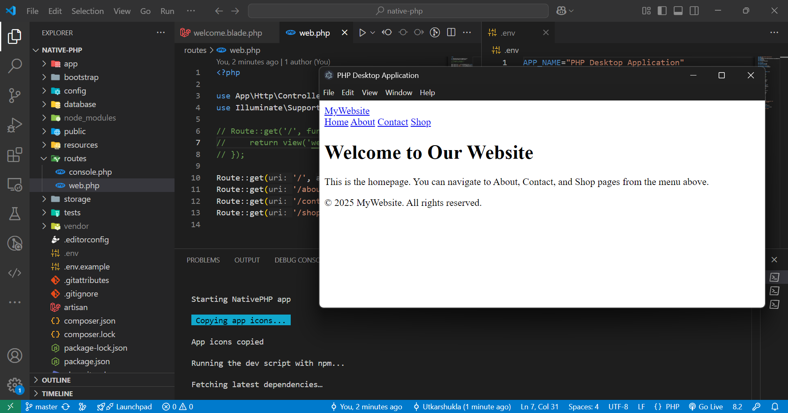
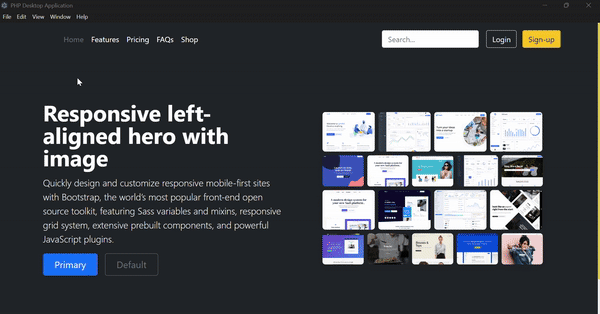

# NativePHP Desktop Application

Welcome to my NativePHP Desktop Application! This application is built using NativePHP, a powerful framework that allows you to create desktop applications using PHP.

---

## 📸 Application Screenshot

  

---





## 🖥️ Installation

### 1. Clone the Repository

```bash
git clone https://github.com/Utkarshukla/desktop-native-php.git
cd nativephp-desktop-app
composer update
